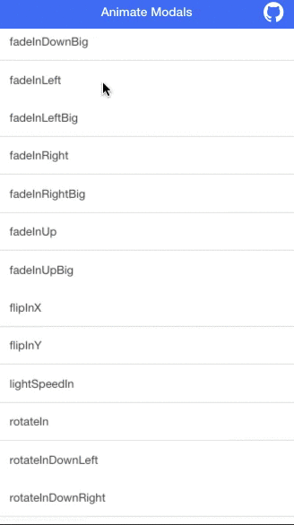

### I tweeted

<blockquote class="twitter-tweet" lang="en"><p lang="en" dir="ltr">Animations work great with <a href="https://twitter.com/Ionicframework">@Ionicframework</a>&#39;s modals. Hooked many in 10 mins. So cool &#10;<a href="https://t.co/sCHtPOSAck">https://t.co/sCHtPOSAck</a> <a href="http://t.co/wvZV5bkJtr">pic.twitter.com/wvZV5bkJtr</a></p>&mdash; Kevin Cobain (@kevincobain2000) <a href="https://twitter.com/kevincobain2000/status/632367134643892224">August 15, 2015</a></blockquote>
<script async src="//platform.twitter.com/widgets.js" charset="utf-8"></script>


https://twitter.com/kevincobain2000/status/632367134643892224

### Personal favorite ``bounceIn``

I use that in my app. http://friendsapp.parseapp.com/

### DEMO (codepen)



http://codepen.io/kevincobain2000/pen/EjJzjx

## How TO

### Add Animate css

https://daneden.github.io/animate.css/

```
<link href="//cdnjs.cloudflare.com/ajax/libs/animate.css/3.4.0/animate.min.css" rel="stylesheet">
```

### Copy Style.css

https://github.com/kevincobain2000/ionic-animated-modal/tree/master/www/css

### Using it


#### HTML

```
<button type="" class="button" ng-click="showModal('bounceIn')">showModal bounceIn</button>
```

#### In your controller

```
  $scope.showModal = function(animation) {
    console.log(animation);
    $ionicModal.fromTemplateUrl('templates/modal.html', {
      scope: $scope,
      animation: 'animated ' + animation,
      hideDelay:920
    }).then(function(modal) {
      $scope.modal = modal;
      $scope.modal.show();
      $scope.hideModal = function(){
        $scope.modal.hide();
        // Note that $scope.$on('destroy') isn't called in new ionic builds where cache is used
        // It is important to remove the modal to avoid memory leaks
        $scope.modal.remove();
      }
    });
  };
```


#### List of Animations

```
bounceIn
bounceInDown
bounceInLeft
bounceInRight
bounceInUp
fadeIn
fadeInDown
fadeInDownBig
fadeInLeft
fadeInLeftBig
fadeInRight
fadeInRightBig
fadeInUp
fadeInUpBig
flipInX
flipInY
lightSpeedIn
rotateIn
rotateInDownLeft
rotateInDownRight
rotateInUpLeft
rotateInUpRight
slideInUp
slideInDown
slideInLeft
slideInRight
zoomIn
zoomInDown
zoomInLeft
zoomInRight
zoomInUp
rollIn
```